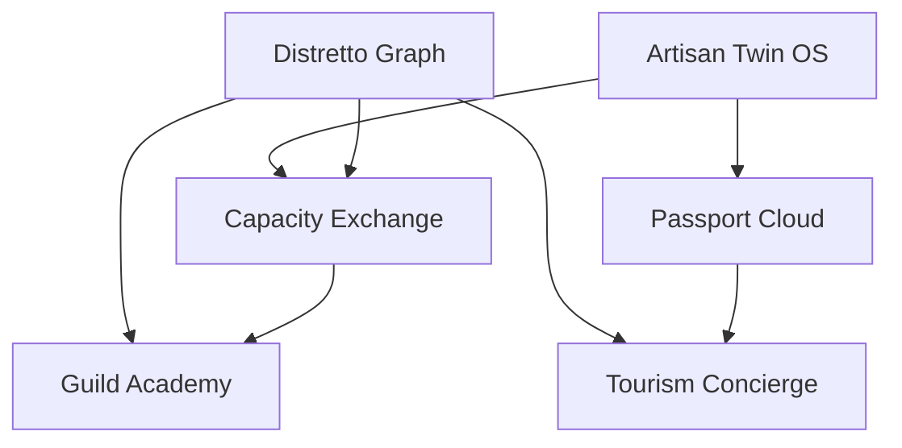

# MOONSHOT ANALYSIS — Bottega Digitale

_Last updated: 2026-05-14_

## Executive summary

Bottega Digitale is no longer just a local-business SaaS. The repository already contains the primitives of a **district operating system**: multi-tenant businesses, bookings, products, orders, loyalty, reviews, WhatsApp, payments, associations, accountant links, marketplace listings, event routing, observability, SEO, public storefronts, and a developer surface. The moonshot opportunity is to stop shipping isolated features and start compounding them into **network effects, provenance, and orchestrated local demand**.

This pass proposes and implements **6 moonshot features**:

1. **Artisan Twin OS**
2. **Distretto Graph**
3. **Capacity Exchange**
4. **Passport Cloud**
5. **Tourism Concierge**
6. **Guild Academy**

Implemented now:
- `/dashboard/moonshot`
- `/api/moonshot`
- `/experiences`
- `/passports/[passportId]`
- `src/lib/moonshot-lab.ts`
- `src/__tests__/moonshot-lab.test.ts`

---

## 1) Deep repository understanding

### Current repository snapshot

| Dimension | Current state |
|---|---:|
| Prisma models | **58** (`prisma/schema.prisma`) |
| API route handlers | **48** (`src/app/api/**/route.ts`) |
| Dashboard pages | **26** (`src/app/dashboard/**/page.tsx`) |
| Top-level service modules | **41** (`src/lib/*.ts`) |
| Passing tests after this work | **497** (`npm test`) |
| Runtime stack | Next.js 16.2.6 + React 19 + App Router + Prisma + LibSQL/Turso |

### Platform architecture

**1. Multi-tenant operational core**
- `Business`, `Membership`, `User`, `Session`, `StaffProfile`, `Customer`, `Booking`, `Service`, `Order`, `Invoice`, `Notification`, `ApiKey`, `WebhookEndpoint`, and `PlatformEvent` already form a serious SaaS backbone in `prisma/schema.prisma`.
- `src/lib/auth.ts` provides the business context abstraction and demo fallback, which makes it easy to add new business-scoped products.
- `src/lib/prisma.ts` already supports **SQLite in local** and **Turso/LibSQL in production**.

**2. Evented platform DNA**
- `src/lib/event-router.ts` already unifies automation, realtime SSE, webhooks, and platform analytics.
- `src/lib/observability.ts`, `src/lib/notification-orchestrator.ts`, `src/lib/realtime.ts`, and `src/lib/platform-analytics.ts` mean the codebase can support orchestration, not just CRUD.

**3. Public commerce and discovery surface**
- Public storefronts already exist: `src/app/s/[slug]/page.tsx`, `src/app/shop/[slug]/page.tsx`, `src/app/book/[slug]/page.tsx`, `src/app/marketplace/page.tsx`, `src/app/directory/page.tsx`.
- `src/lib/marketplace.ts`, `src/lib/seo.ts`, `src/app/api/directory/route.ts`, and `src/app/api/marketplace/route.ts` already expose enough surface area to treat the district itself as inventory.

**4. Network and channel primitives already shipped**
- `Association`, `AssociationMembership`, `GroupSubscription`, `Partnership`, `CrossPromotion`, `Voucher`, `GiftCard`, `WhatsappMessage`, `CustomerSession`, `EmailDelivery`, `NotificationPreference`, and `NotificationLog` are latent network-effect primitives.
- This is the strongest signal in the repo: Bottega Digitale is already structurally positioned to become a **coordinating layer between artisans**, not just a dashboard for each artisan.

**5. Compliance / trust stack**
- `FiscalProfile`, `Invoice`, `CustomerConsent`, `AuditLog`, `DataExportRequest`, and `EmailTemplateOverride` give the product legitimacy in Italy, where trust and compliance are part of the moat.
- This matters because moonshots like provenance, district commerce, and tourism packaging need trust infrastructure to feel credible.

### Latent capabilities the repo can unlock

1. **Cross-business orchestration** from marketplace + partnerships + associations + event router.
2. **Autonomous recommendations** from platform analytics + jobs + notifications + realtime.
3. **Public trust and discoverability** from storefronts + SEO + future passport pages.
4. **New supply creation** from staff, association, accountant, and business-template systems.
5. **High-context customer memory** from loyalty + customer sessions + notification preferences + bookings.

### Constraints and architectural realities

1. **Most network effects are still represented as primitives, not products.** The schema is ahead of the UX.
2. **Business context is mostly single-business in the UI.** The code can model a network; the current dashboard mostly renders one node.
3. **Some flows still use demo-first assumptions** (`getBusinessContext()` fallback, sample-centric pages, seeded demo businesses).
4. **LibSQL/Turso favors elegant, bounded writes.** That argues for evented orchestration and denormalized views rather than highly chatty transactional mesh logic.
5. **The best moonshots should compose existing surfaces** instead of adding a seventh isolated subsystem.

### Repository evidence

- Schema and domain breadth: `prisma/schema.prisma`
- Production DB adapter: `src/lib/prisma.ts`
- Event orchestration: `src/lib/event-router.ts`
- Observability: `src/lib/observability.ts`
- Marketplace: `src/lib/marketplace.ts`
- Association portal: `src/lib/association-portal.ts`
- AI advisor: `src/lib/ai-advisor.ts`
- Seeded demo district: `prisma/seed.ts`
- New moonshot workspace: `src/lib/moonshot-lab.ts`, `src/app/dashboard/moonshot/page.tsx`

---

## 2) Market and competitive research

### Macro signals

1. **Italy is dominated by micro-businesses**, and the digitalization gap remains material. See the European Investment Bank’s work on SME digitalization in Italy and the European Commission SME fact sheet for Italy:  
   - https://www.eib.org/attachments/thematic/digitalisation_of_smes_in_italy_summary_en.pdf  
   - https://single-market-economy.ec.europa.eu/document/download/c9e8abb8-e296-4e9d-b527-e04652c074f6_en?filename=Italy%20-%20SME%20Fact%20Sheet%202025.pdf&prefLang=lv

2. **Emilia-Romagna already markets craft, food, and workshop experiences as destination assets**. That means a tourism-commerce layer is not speculative; the region is already conditioning demand around authentic local experiences:  
   - https://emiliaromagnaturismo.it/en/itineraries/romagnas-ancient-crafts-through-workshops-traditions-craftsmens-knowhow  
   - https://emiliaromagnaturismo.it/en/experiences

3. **The EU Digital Product Passport makes provenance and repairability strategically relevant**. Artisans can turn compliance pressure into a premium trust signal:  
   - https://data.europa.eu/en/news-events/news/eus-digital-product-passport-advancing-transparency-and-sustainability  
   - https://eur-lex.europa.eu/legal-content/EN/TXT/?uri=CELEX%3A32024R1781

4. **Messaging remains structurally important in Italy**; WhatsApp remains one of the natural customer channels for SMEs, which strengthens Bottega Digitale’s messaging-first posture:  
   - https://www.linkmobility.com/blog/whatsapp-use-in-europe-and-adoption-across-countries

### Competitive map

| Category | Representative players | What they do well | Structural gap vs. Bottega Digitale |
|---|---|---|---|
| Website / booking builders | Wix Bookings — https://www.wix.com/bookings | Self-serve publishing and booking UX | Weak on local network effects, Italian compliance, district-level orchestration |
| Vertical beauty marketplace | Treatwell for Partners — https://partners.treatwell.com/ | Supply-demand matching in one vertical | Marketplace rents demand instead of giving districts a shared operating system |
| Payments / POS | SumUp — https://www.sumup.com/it-it/ | Merchant acceptance and hardware distribution | Not built for provenance, neighborhood bundles, training, or cooperative demand routing |
| Back-office / invoicing | Fatture in Cloud — https://www.fattureincloud.it/ | Italian accounting legitimacy | No public commerce, no booking, no loyalty, no district graph |

### Strategic market conclusion

The whitespace is **not** “a slightly better booking app for artisans.” The whitespace is:

> **the operating system for a local economic district**, where software orchestrates demand, trust, training, provenance, and overflow across many independent micro-businesses.

---

## 3) Innovation vectors

1. **AI orchestration over point solutions**  
   Move from dashboards that report to a twin that decides, routes, and simulates.

2. **Network effects at district level**  
   Move from merchant SaaS to a cooperative graph where each new merchant increases inventory quality for the whole city.

3. **Trust through provenance and repairability**  
   Turn artisan identity into structured, searchable, QR-addressable product memory.

4. **Destination commerce**  
   Package districts as bookable experiences for tourists, residents, events, and destination weddings.

---

## 4) Moonshot feature portfolio (implemented)

## 4.1 Artisan Twin OS

**Vision**  
Every bottega gets a living operating twin that continuously models demand, loyalty, resilience, and partner leverage — effectively an AI chief-of-staff for a micro-business.

**Requirements**
- Unified business snapshot across bookings, orders, repeat customers, health score, and partnerships.
- Autonomy score + mission generation.
- Simulation layer for “what if” scenarios.
- Output must be legible both to humans and downstream APIs.

**Architecture**
- Data source: `MoonshotBusinessSnapshot` in `src/lib/moonshot-lab.ts`
- Computation: `buildArtisanTwin()`
- UX surface: `/dashboard/moonshot`
- API surface: `/api/moonshot`

**Implemented API / UI**
- `GET /api/moonshot` returns the twin payload inside the full portfolio workspace.
- `/dashboard/moonshot` renders metrics, missions, and simulations.

**Implementation plan**
1. Build the snapshot layer.
2. Add recommendation memory from event/analytics signals.
3. Upgrade to closed-loop execution through notifications, jobs, and event-router triggers.

---

## 4.2 Distretto Graph

**Vision**  
The neighborhood becomes the product: Bottega Digitale stops listing shops and starts modeling the district as a graph of complementary inventory.

**Requirements**
- Cross-business node model.
- Edge scoring across categories and digital maturity.
- Bundle generation for gifting, events, and resident flows.
- District graph must be queryable as structured JSON.

**Architecture**
- Graph nodes/edges: `buildDistrictGraph()` in `src/lib/moonshot-lab.ts`
- Rendered in `/dashboard/moonshot`
- Included in `/api/moonshot`

**Implemented API / UI**
- Strength-scored edges.
- Bundle candidates generated from top graph edges.
- Portfolio dependency graph shown in dashboard.

**Implementation plan**
1. Score adjacency from category archetypes + partnership readiness.
2. Pipe graph into public routing and CRM recommendations.
3. Add transaction settlement / revenue-sharing later.

---

## 4.3 Capacity Exchange

**Vision**  
Overflow demand becomes shared district GDP: when one bottega is full, the system can route the opportunity to a trusted partner instead of letting the demand vanish.

**Requirements**
- Detect hotspots vs. underused capacity.
- Generate candidate reroutes with an SLA window.
- Preserve customer continuity, trust, and eventual revenue-share rules.
- Operate as policy, not manual spreadsheet work.

**Architecture**
- Capacity scoring: `buildCapacityExchange()` in `src/lib/moonshot-lab.ts`
- Dashboard surfacing: `/dashboard/moonshot`
- JSON output: `/api/moonshot`

**Implemented API / UI**
- Hotspot list.
- Receiver list.
- Match proposals with reason and SLA.
- Operating rules for future productization.

**Implementation plan**
1. Start with district recommendations.
2. Add quote/accept/decline workflow.
3. Connect to availability, notifications, and loyalty continuity.

---

## 4.4 Passport Cloud

**Vision**  
Every service, product, and experience earns a digital memory: provenance, care, repair routes, and trust signals become a reusable asset.

**Requirements**
- Passport records for service/product/experience types.
- Materials, care, repair, and proof-point layers.
- Public rendering surface.
- Reusable identity across SEO, gifting, post-sale support, and future compliance.

**Architecture**
- Passport generation: `buildPassportCloud()`
- Public route: `/passports/[passportId]`
- Dashboard summary: `/dashboard/moonshot`
- Portfolio API: `/api/moonshot`

**Implemented API / UI**
- Passport record generation.
- Public passport detail page.
- Metadata generation for passport pages.
- Dashboard shortcuts into the first demo passport.

**Implementation plan**
1. Start with synthetic passports.
2. Bind to real products/services and media assets.
3. Add QR codes, customer registration, and repair events.

---

## 4.5 Tourism Concierge

**Vision**  
Bottega Digitale becomes a destination-commerce engine: the district is sold as a coordinated itinerary rather than isolated listings.

**Requirements**
- Persona-based itineraries.
- Cross-category stop sequencing.
- Public landing surface.
- Compatibility with marketplace / storefront inventory.

**Architecture**
- Itinerary generation: `buildTourismConcierge()`
- Public route: `/experiences`
- Dashboard planning surface: `/dashboard/moonshot`
- Portfolio API: `/api/moonshot`

**Implemented API / UI**
- Three itinerary archetypes.
- Public experience page.
- Signals explaining why the feature matters strategically.

**Implementation plan**
1. Prototype curated itineraries.
2. Add real booking / payment bundling.
3. Add hotel, event, and destination-wedding distribution.

---

## 4.6 Guild Academy

**Vision**  
Solve succession and skill scarcity by turning district training into software: residencies, credentials, and operator creation become part of the platform.

**Requirements**
- Skill-cluster map.
- Residency program generation.
- Credential ladder.
- Must connect to district supply creation, not just HR admin.

**Architecture**
- Skill graph: `buildGuildAcademy()`
- Dashboard surface: `/dashboard/moonshot`
- JSON surface: `/api/moonshot`

**Implemented API / UI**
- Skill clusters with demand scores.
- Residency programs with host businesses.
- Credential ladder rendered in the moonshot dashboard.

**Implementation plan**
1. Start with district planning.
2. Add application / matching workflow.
3. Connect to association portals and revenue-sharing for incubated operators.

---

## 5) Portfolio view

### Dependency graph

### Build sequence

1. **Foundation:** Artisan Twin OS + Distretto Graph  
   Establish orchestration and graph memory.
2. **Trust + routing:** Capacity Exchange + Passport Cloud  
   Convert overflow into supply and identity into trust.
3. **Expansion loops:** Tourism Concierge + Guild Academy  
   Create new demand and new supply on top of the graph.

### Why this sequencing works

- Twin + Graph are the **control plane**.
- Exchange + Passport are the **execution and trust plane**.
- Concierge + Academy are the **growth loops**.

---

## 6) Strategic verdict

### Scorecard

| Dimension | Score / 10 | Why |
|---|---:|---|
| Repo leverage | **9.5** | Uses primitives the repository already owns instead of inventing a new product line |
| Moat creation | **9.5** | Strongest path to local network effects, provenance trust, and operator flywheels |
| Monetization upside | **9.0** | Adds new revenue surfaces: routing, concierge bundles, passport services, academy programs |
| Build realism | **8.0** | The v0 can ship now; the full loop needs settlement, permissions, and workflow depth |
| Competitive defensibility | **9.0** | Hard for generic builders and single-vertical apps to copy because it spans network, trust, and regional demand |
| Time horizon fit | **10.0** | Bold, long-horizon, market-redefining rather than incremental |

### Verdict

**Go.**  
The highest-value future for this repository is not another dashboard tab. It is a **district-scale coordination platform** for Italian artisans. The repo already contains enough assets to credibly begin that transition. The implemented moonshot layer proves the product can now model:

- autonomous merchant intelligence,
- district-level inventory graphs,
- overflow routing,
- passport-based trust,
- destination-commerce packaging,
- and talent/succession loops.

That is a far more defensible future than competing head-on with generic site builders or booking apps.

---

## 7) Implemented in this pass

### New files
- `src/lib/moonshot-lab.ts`
- `src/app/dashboard/moonshot/page.tsx`
- `src/app/api/moonshot/route.ts`
- `src/app/experiences/page.tsx`
- `src/app/passports/[passportId]/page.tsx`
- `src/__tests__/moonshot-lab.test.ts`
- `MOONSHOT-ANALYSIS.md`

### Updated files
- `src/app/dashboard/layout.tsx` — added **Moonshot Lab** navigation entry
- Lint-safe fixes in:
  - `src/app/api/loyalty/checkin/route.ts`
  - `src/app/c/[slug]/page.tsx`
  - `src/app/dashboard/analytics/page.tsx`
  - `src/app/dashboard/staff/page.tsx`
  - `src/app/loyalty/[businessId]/page.tsx`
  - `src/components/useRealtimeEvents.ts`
  - `src/lib/e-invoice.ts`

### Validation
- `npm run lint` ✅
- `npm test` ✅ (**497 passing tests**)
- `npm run build` ✅
