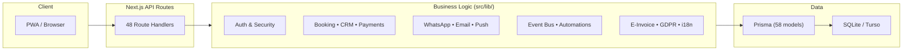

<div align="center">

# 🏪 Bottega Digitale

**Il bancone digitale per artigiani, botteghe e piccole imprese italiane**

*A comprehensive digital toolkit for Italian SMEs — from appointment booking to electronic invoicing, WhatsApp automation to AI-powered insights.*

[](https://nextjs.org)
[](https://typescriptlang.org)
[](https://prisma.io)
[]()

</div>

---

## Overview

Bottega Digitale is a full-stack platform built for Italian artisans, shops, and small businesses. It provides 70+ integrated features spanning appointment management, customer relations, payments, loyalty programs, electronic invoicing, WhatsApp automation, and AI-powered business intelligence — all designed for the Italian market with native i18n, GDPR compliance, and FatturaPA e-invoicing.

### Key Capabilities

| Domain | Features |
|---|---|
| 📅 **Booking & Queue** | Online booking, walk-in queue, staff scheduling, availability calendar |
| 👥 **CRM** | Customer profiles, visit tracking, segmentation, OTP-based self-service |
| 💳 **Payments** | Stripe Connect, booking deposits, gift cards, payment dashboard |
| 🧾 **Invoicing** | FatturaPA XML generation, IVA rates, fiscal profiles, SDI-ready |
| 🏷️ **Loyalty** | Points system, loyalty cards, automated rewards, redemptions |
| 📱 **WhatsApp** | Business API integration, template messages, AI-powered chatbot |
| 📧 **Email** | Transactional emails via Resend, i18n templates, delivery tracking |
| 🤖 **AI** | Social post generation, business insights, conversational AI |
| 🏪 **Commerce** | Product catalog, online storefront, order management |
| 🔔 **Notifications** | Multi-channel orchestration (push, WhatsApp, email), quiet hours |
| ⚡ **Automations** | Event-driven flows (booking → loyalty → WhatsApp → CRM) |
| 🌐 **Marketplace** | Cross-business listings, partnerships, cross-promotions, vouchers |
| 🏛️ **Associations** | Trade association portals, bulk onboarding, group subscriptions |
| 🧮 **Accountant** | Accountant portal, client financial data, CSV exports |
| 🔒 **Security** | Rate limiting, CSRF, input validation, API keys, webhook signing |
| 🇪🇺 **GDPR** | Data export (Art. 20), erasure (Art. 17), consent management, audit logs |
| 📊 **Analytics** | Business health scores, MRR tracking, platform-wide dashboards |
| 🗺️ **SEO** | JSON-LD structured data, dynamic sitemap, robots.txt |
| 📁 **Media** | Asset management, storage quotas, presigned uploads |
| 🔗 **Developer API** | API keys, webhooks, OpenAPI spec, rate-limited endpoints |

---

## Tech Stack

| Layer | Technology |
|---|---|
| **Framework** | [Next.js 16](https://nextjs.org) (App Router, React 19) |
| **Language** | TypeScript 5 |
| **Database** | SQLite (dev) / [Turso](https://turso.tech) LibSQL (prod) |
| **ORM** | [Prisma 7](https://prisma.io) with LibSQL adapter (58 models) |
| **Styling** | [Tailwind CSS 4](https://tailwindcss.com), CVA, tailwind-merge |
| **Payments** | [Stripe](https://stripe.com) Connect + Checkout |
| **Messaging** | WhatsApp Business API, [Resend](https://resend.com) |
| **AI** | [OpenAI](https://openai.com) API |
| **Testing** | [Vitest 4](https://vitest.dev), Testing Library (517 tests) |
| **Deployment** | Vercel (primary), Docker (self-hosted) |

---

## Quick Start

### Prerequisites

- **Node.js** ≥ 20
- **npm** ≥ 9

### Setup

```bash
# Clone and install
git clone <repo-url>
cd bottega-digitale
npm install

# Configure environment
cp .env.example .env
# Edit .env with your API keys (all are optional for local dev)

# Initialize database
npx prisma generate
npx prisma db push
npx tsx prisma/seed.ts   # Load demo data (3 businesses in Forlì)

# Start development server
npm run dev
```

Open [http://localhost:3000](http://localhost:3000) — the app works in demo mode without any external API keys.

### Demo Data

The seed creates three demo businesses in Forlì:

| Business | Type | Demo Data |
|---|---|---|
| 🪒 Barberia Da Marco | Barbershop | 6 services, 50 customers, 200 bookings, 15 reviews, 20 loyalty cards |
| 🍝 Trattoria Nonna Rosa | Restaurant | 12 products, 80 orders, 8 reviews |
| 🌻 Fiorista Girasole | Florist | 8 products, 30 orders |

---

## Scripts

```bash
npm run dev           # Start development server (Turbopack)
npm run build         # Production build
npm run start         # Start production server
npm run lint          # ESLint
npm run test          # Run all tests (Vitest)
npm run test:watch    # Watch mode
npm run test:coverage # Coverage report (60% threshold on src/lib/)
```

---

## Environment Variables

All integrations are optional and gracefully degrade when not configured.

```bash
# Database
DATABASE_URL="file:prisma/dev.db"    # Local SQLite (default)
TURSO_DATABASE_URL=""                 # Turso LibSQL for production
TURSO_AUTH_TOKEN=""

# Payments
STRIPE_SECRET_KEY=""
STRIPE_WEBHOOK_SECRET=""

# Messaging
WHATSAPP_TOKEN=""
WHATSAPP_VERIFY_TOKEN=""
RESEND_API_KEY=""
EMAIL_FROM="Bottega Digitale <noreply@bottegadigitale.it>"

# AI
OPENAI_API_KEY=""

# Google Business
GOOGLE_CLIENT_ID=""
GOOGLE_CLIENT_SECRET=""

# Push Notifications
VAPID_PUBLIC_KEY=""
VAPID_PRIVATE_KEY=""

# Media Storage (S3-compatible)
MEDIA_STORAGE_ENDPOINT=""
MEDIA_STORAGE_KEY=""
MEDIA_STORAGE_SECRET=""
MEDIA_STORAGE_BUCKET="bottega-media"
MEDIA_CDN_URL=""

# Infrastructure
CRON_SECRET=""
WEBHOOK_SIGNING_SECRET=""
NEXT_PUBLIC_URL="http://localhost:3000"
```

---

## Project Structure

```
bottega-digitale/
├── prisma/
│   ├── schema.prisma         # 58 database models
│   ├── seed.ts               # Demo data seeder
│   └── dev.db                # Local SQLite database
├── src/
│   ├── app/                   # Next.js App Router
│   │   ├── api/               # 48 REST API endpoints
│   │   ├── dashboard/         # Business owner dashboard (20+ pages)
│   │   ├── staff/             # Staff mobile interface
│   │   ├── (auth)/            # Login, Register, Onboarding
│   │   ├── admin/             # Platform administration
│   │   ├── commercialista/    # Accountant portal
│   │   ├── association/       # Trade association portal
│   │   ├── book/[slug]        # Public booking widget
│   │   ├── shop/[slug]        # Public storefront
│   │   ├── developers/        # Developer portal & API docs
│   │   └── ...
│   ├── lib/                   # Business logic modules (40+ files)
│   ├── components/            # Shared React components
│   ├── generated/             # Prisma-generated client
│   ├── messages/              # i18n translations (it, en)
│   └── __tests__/             # 517 test cases
├── docs/
│   ├── ARCHITECTURE.md        # Architecture overview + diagrams
│   └── API.md                 # Complete API reference
├── docker-compose.yml
├── Dockerfile
└── vercel.json
```

---

## Architecture

The platform follows a layered architecture with event-driven automation:



For the full architecture with data flow diagrams, entity relationships, and deployment topology, see **[docs/ARCHITECTURE.md](docs/ARCHITECTURE.md)**.

---

## API

The platform exposes 48 RESTful API endpoints covering:

- **Authentication** — Session-based auth with rate-limited login/register
- **CRUD** — Bookings, customers, products, orders, staff, invoices
- **Integrations** — Stripe checkout/webhooks, WhatsApp send/receive, Google sync
- **Real-time** — SSE event stream for live dashboard updates
- **Developer** — API keys, webhooks, OpenAPI spec at `/api/openapi`
- **Infrastructure** — Health checks, cron jobs, sitemap, robots.txt

For the complete API reference, see **[docs/API.md](docs/API.md)**.

---

## Deployment

### Vercel (Recommended)

The project is configured for Vercel out of the box:

```bash
# vercel.json configures:
# - Build: prisma generate + next build
# - Region: cdg1 (Paris)
# - Cron: /api/jobs every 15 minutes
# - Security headers on /api/*

vercel deploy
```

### Docker

```bash
# Build and run
docker compose up -d

# Or manually
docker build -t bottega-digitale .
docker run -p 3000:3000 \
  -e DATABASE_URL="file:prisma/dev.db" \
  bottega-digitale
```

The Docker image uses a multi-stage build (node:20-alpine) with Next.js standalone output. Health checks hit `/api/health`.

---

## Testing

```bash
# Run all 517 tests
npm test

# Watch mode
npm run test:watch

# Coverage (60% threshold on src/lib/)
npm run test:coverage
```

Tests cover all core library modules with Vitest and use direct function testing (no HTTP mocking required for business logic).

---

## Italian-Specific Features

| Feature | Description |
|---|---|
| 🧾 **FatturaPA** | Electronic invoicing with XML generation per Italian tax requirements |
| 💰 **IVA Rates** | Standard (22%), reduced (10%), super-reduced (4%), exempt |
| 🇪🇺 **GDPR** | Full compliance: data export, erasure, consent, audit logging, privacy policy generator |
| 🌍 **i18n** | Italian-first with English support, locale-aware formatting |
| 📱 **Codice Fiscale** | Fiscal code support in invoicing |
| 🏛️ **Trade Associations** | Partita IVA validation, group subscriptions |
| 🗺️ **Regional Config** | Per-city configuration (VAT rates, categories, associations) |

---

## Documentation

| Document | Description |
|---|---|
| [docs/ARCHITECTURE.md](docs/ARCHITECTURE.md) | Architecture overview, Mermaid diagrams, data model |
| [docs/API.md](docs/API.md) | Complete API reference for all 48 endpoints |
| [AGENTS.md](AGENTS.md) | AI agent instructions |

---

## License

Private — All rights reserved.
