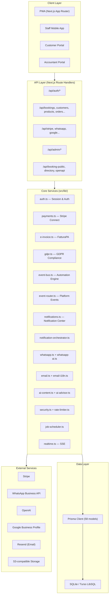
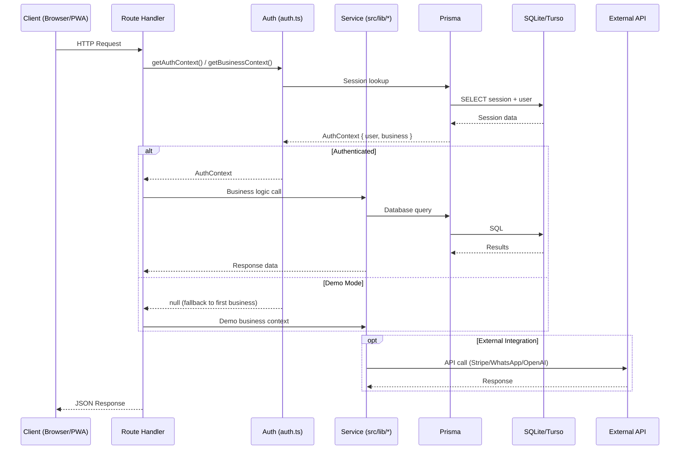
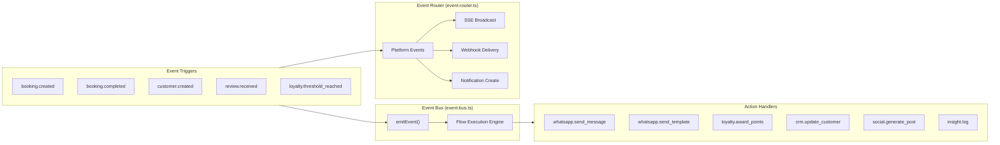
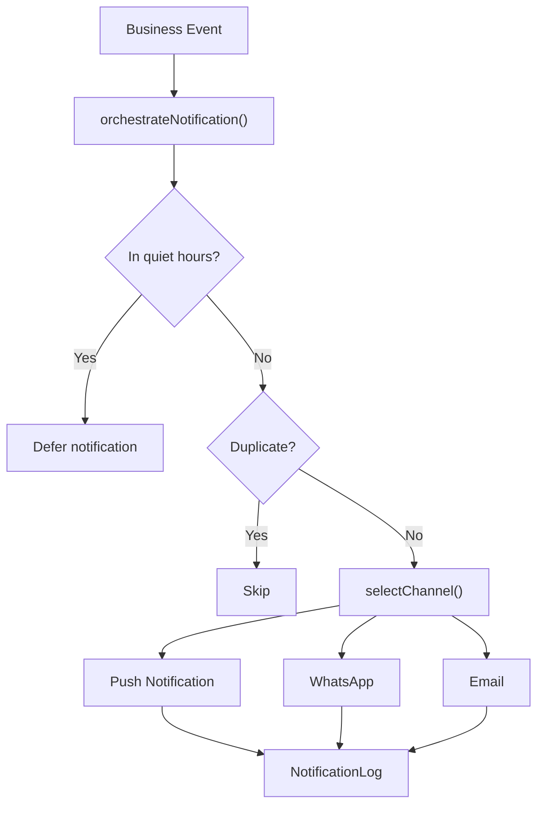
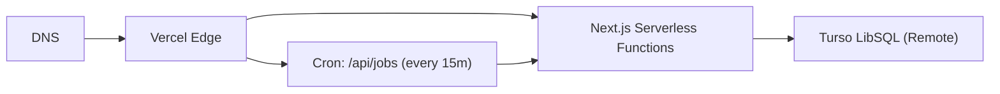

# Architecture Overview

> **Bottega Digitale** — Digital toolkit for Italian SMEs, artisans, and small businesses in Forlì

## Technology Stack

| Layer | Technology |
|---|---|
| Framework | Next.js 16 (App Router, React 19) |
| Language | TypeScript 5 |
| Database | SQLite (dev) / Turso LibSQL (prod) |
| ORM | Prisma 7 with LibSQL adapter |
| Styling | Tailwind CSS 4, CVA, `tailwind-merge` |
| Payments | Stripe Connect + Checkout |
| Messaging | WhatsApp Business API, Resend (email) |
| AI | OpenAI API (content generation, conversational AI) |
| Testing | Vitest 4, Testing Library |
| Deployment | Vercel (primary), Docker (self-hosted) |
| Icons | Lucide React |

---

## High-Level Architecture



---

## Request Flow



---

## Event-Driven Automation

The platform uses a two-tier event system:



### Automation Flow Templates (Pre-built)

| Flow | Trigger | Actions |
|---|---|---|
| Booking confirmation + loyalty | `booking.created` | Send WhatsApp template → Award 10 loyalty points |
| Post-visit follow-up | `booking.completed` | Request review via WhatsApp → Update CRM |
| Welcome new customer | `customer.created` | Send welcome message → Award 20 bonus points |
| Auto-respond to review | `review.received` | Generate social post → Log insight |
| Loyalty reward reached | `loyalty.threshold_reached` | Send reward notification via WhatsApp |

---

## Multi-Tenant Data Model

```mermaid
erDiagram
    User ||--o{ Membership : has
    Business ||--o{ Membership : has
    Business ||--o{ Service : offers
    Business ||--o{ Booking : has
    Business ||--o{ Customer : manages
    Business ||--o{ Review : receives
    Business ||--o{ Product : sells
    Business ||--o{ Order : fulfills
    Business ||--o{ LoyaltyCard : issues
    Business ||--o{ WhatsappMessage : sends
    Business ||--o{ AutomationFlow : configures
    Business ||--o{ Notification : receives
    Business ||--o{ StaffProfile : employs
    Business ||--o{ QueueEntry : queues
    Business ||--o{ GiftCard : offers
    Business ||--o{ Invoice : generates
    Business ||--o{ MediaAsset : stores
    Business ||--o{ ApiKey : authenticates
    Business ||--o{ WebhookEndpoint : subscribes

    Customer ||--o{ Booking : makes
    Customer ||--o{ LoyaltyCard : holds
    Customer ||--o{ QueueEntry : joins
    Customer ||--o{ CustomerSession : authenticates
    Customer ||--o{ CustomerConsent : grants

    Service ||--o{ Booking : booked_for
    StaffProfile ||--o{ Booking : assigned_to

    Association ||--o{ AssociationMembership : has
    Association ||--o{ AssociationAdmin : managed_by
    Association ||--o| GroupSubscription : subscribes
    Business ||--o{ AssociationMembership : joins

    Accountant ||--o{ AccountantClientLink : manages
    Business ||--o{ AccountantClientLink : linked_to

    Business ||--o| FiscalProfile : has
    FiscalProfile ||--o{ Invoice : generates
    Invoice ||--o{ InvoiceLine : contains

    Partnership }o--|| Business : connects
    Partnership ||--o{ CrossPromotion : enables
    CrossPromotion ||--o{ Voucher : generates
```



### Key Models (58 total)

| Domain | Models |
|---|---|
| **Core** | `User`, `Session`, `Business`, `Membership` |
| **Booking & Queue** | `Service`, `Booking`, `Customer`, `QueueEntry`, `StaffProfile` |
| **Commerce** | `ProductCategory`, `Product`, `Order`, `OrderItem` |
| **Loyalty** | `LoyaltyCard`, `LoyaltyRedemption` |
| **Payments** | `PaymentTransaction`, `GiftCard`, `StripeEvent` |
| **Invoicing** | `FiscalProfile`, `Invoice`, `InvoiceLine` |
| **Communication** | `WhatsappMessage`, `SocialPost`, `PushSubscription`, `ConversationState` |
| **Email** | `EmailDelivery`, `EmailTemplateOverride` |
| **Notifications** | `Notification`, `NotificationPreference`, `NotificationLog` |
| **Automation** | `AutomationFlow`, `FlowExecution`, `Job`, `Insight` |
| **Marketplace** | `Partnership`, `CrossPromotion`, `Voucher`, `MarketplaceListing` |
| **Association** | `Association`, `AssociationMembership`, `AssociationAdmin`, `GroupSubscription` |
| **Accountant** | `Accountant`, `AccountantClientLink` |
| **GDPR & Security** | `CustomerConsent`, `AuditLog`, `DataExportRequest`, `RateLimit` |
| **Platform** | `PlatformEvent`, `BusinessHealthScore`, `RegionConfig`, `TranslationOverride` |
| **Developer** | `ApiKey`, `WebhookEndpoint`, `WebhookDelivery` |
| **Media** | `MediaAsset` |

---

## Module Dependency Map

```mermaid
graph TD
    prisma["prisma.ts<br/>(Singleton Client)"]

    auth["auth.ts"] --> prisma
    security["security.ts"] --> prisma
    rateLimiter["rate-limiter.ts"]

    payments["payments.ts"] --> prisma
    eInvoice["e-invoice.ts"] --> prisma
    gdpr["gdpr.ts"] --> prisma

    notifications["notifications.ts"] --> prisma
    orchestrator["notification-orchestrator.ts"] --> prisma

    eventBus["event-bus.ts"] --> prisma
    eventRouter["event-router.ts"] --> prisma
    eventRouter --> notifications
    eventRouter --> realtime

    realtime["realtime.ts"]

    whatsapp["whatsapp.ts"]
    whatsappAI["whatsapp-ai.ts"] --> prisma
    email["email.ts"] --> prisma
    emailI18n["email-i18n.ts"] --> prisma

    aiContent["ai-content.ts"]
    aiAdvisor["ai-advisor.ts"] --> prisma

    jobs["job-scheduler.ts"] --> prisma
    marketplace["marketplace.ts"] --> prisma
    productCatalog["product-catalog.ts"] --> prisma
    availability["availability.ts"] --> prisma

    staffMobile["staff-mobile.ts"] --> prisma
    customerAuth["customer-auth.ts"] --> prisma

    accountant["accountant-portal.ts"] --> prisma
    association["association-portal.ts"] --> prisma

    media["media.ts"] --> prisma
    webhookApi["webhook-api.ts"] --> prisma
    seo["seo.ts"]
    observability["observability.ts"]

    i18n["i18n/"]
    onboarding["onboarding.ts"]
    billingAnalytics["billing-analytics.ts"] --> prisma
    platformAnalytics["platform-analytics.ts"] --> prisma

    style prisma fill:#f59e0b,color:#000
```



---

## Notification Orchestration



---

## Deployment Architecture

### Vercel (Primary)



### Docker (Self-Hosted)

```
┌────────────────────────────────┐
│  Docker Container (node:20)    │
│  ┌──────────────────────────┐  │
│  │  Next.js Standalone      │  │
│  │  Port 3000               │  │
│  │  ┌────────────────────┐  │  │
│  │  │ Prisma + LibSQL    │  │  │
│  │  │ (SQLite or Turso)  │  │  │
│  │  └────────────────────┘  │  │
│  └──────────────────────────┘  │
│  Healthcheck: /api/health      │
└────────────────────────────────┘
```

---

## Security Architecture

| Layer | Mechanism |
|---|---|
| **Authentication** | Session tokens in HTTP-only cookies (30-day expiry) |
| **Password Hashing** | SHA-256 with salt via Web Crypto API |
| **Rate Limiting** | DB-backed sliding window per category (login, register, OTP, API) |
| **API Keys** | SHA-256 hashed, prefix-based lookup, per-key rate limits |
| **CSRF** | Constant-time token comparison |
| **Input Validation** | Field-level type/format/length validation |
| **Sanitization** | HTML entity encoding, SQL character stripping |
| **Headers** | CSP, HSTS, X-Frame-Options, X-Content-Type-Options |
| **GDPR** | Consent management, data export (Art. 20), erasure (Art. 17), audit logs |
| **Webhooks** | HMAC-SHA256 payload signing |

---

## Internationalization

- **Default locale**: `it` (Italian)
- **Supported locales**: `it`, `en`
- **Translation files**: `src/messages/it.json`, `src/messages/en.json`
- **Email i18n**: Separate i18n email renderers (`email-i18n.ts`)
- **Locale detection**: `Accept-Language` header parsing
- **Formatting**: Locale-aware dates, times, currencies, phone numbers

---

## Directory Structure

```
bottega-digitale/
├── prisma/
│   ├── schema.prisma        # 58 models
│   ├── seed.ts              # Demo data (3 businesses in Forlì)
│   └── dev.db               # Local SQLite database
├── src/
│   ├── app/                  # Next.js App Router
│   │   ├── layout.tsx        # Root layout (Navbar, Footer, PWA)
│   │   ├── page.tsx          # Landing page (Hero, Features, Pricing)
│   │   ├── api/              # 48 API route handlers
│   │   ├── dashboard/        # Business owner dashboard (20+ pages)
│   │   ├── staff/            # Staff mobile view
│   │   ├── (auth)/           # Login, Register, Onboarding
│   │   ├── admin/            # Platform admin pages
│   │   ├── commercialista/   # Accountant portal
│   │   ├── association/      # Trade association portal
│   │   ├── book/[slug]       # Public booking page
│   │   ├── shop/[slug]       # Public storefront
│   │   ├── directory/        # Business directory
│   │   ├── marketplace/      # Cross-business marketplace
│   │   ├── developers/       # Developer portal + API docs
│   │   └── ...
│   ├── lib/                  # Core business logic (40+ modules)
│   ├── components/           # Shared React components
│   ├── generated/            # Prisma generated client
│   ├── messages/             # i18n translation files
│   └── __tests__/            # 517 test cases (Vitest)
├── docs/                     # Documentation
├── docker-compose.yml        # Docker deployment
├── Dockerfile                # Multi-stage Docker build
└── vercel.json               # Vercel deployment config
```
