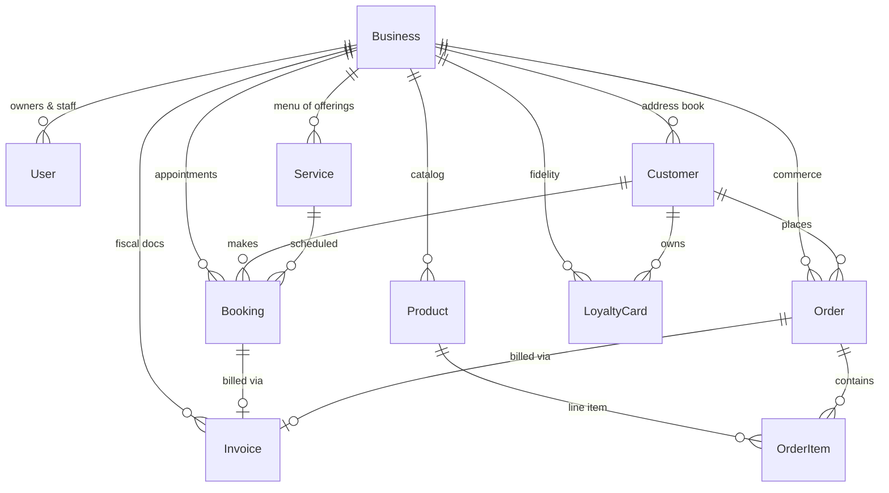

# Data model

Bottega Digitale uses a single Prisma schema with 58 models. They group into eight aggregates, each owned by a domain service in `src/lib/`.

## Aggregates at a glance



## The eight aggregates

| Aggregate | Owner module | Key models |
| --- | --- | --- |
| **Tenant** | `lib/auth.ts` | `Business`, `User`, `Session`, `ApiKey` |
| **CRM** | `lib/customer-crm.ts` | `Customer`, `CustomerNote`, `CustomerConsent` |
| **Catalog** | `lib/product-catalog.ts` | `Service`, `Product`, `ProductCategory`, `ProductVariant` |
| **Scheduling** | `lib/availability.ts` | `Booking`, `StaffSchedule`, `QueueEntry`, `Blackout` |
| **Commerce** | `lib/payments.ts` | `Order`, `OrderItem`, `Payment`, `GiftCard` |
| **Invoicing** | `lib/e-invoice.ts` | `Invoice`, `InvoiceLine`, `FiscalProfile` |
| **Loyalty** | `lib/customer-crm.ts` | `LoyaltyCard`, `LoyaltyTransaction`, `LoyaltyProgram` |
| **Comms** | `lib/notifications.ts` | `Notification`, `WhatsAppMessage`, `WebhookDelivery` |

## Reading the schema

The canonical source is `prisma/schema.prisma`. Every model carries:

- `id` — a CUID-style ID with a domain prefix (`bkg_…`, `cus_…`, `inv_…`)
- `businessId` — the tenant scope; see [Multi-tenancy](./multi-tenancy)
- `createdAt` / `updatedAt` — UTC timestamps
- `deletedAt` — soft delete marker; nullable

## Example: the Booking model

```prisma
model Booking {
  id               String         @id @default(cuid())
  businessId       String
  customerId       String?
  serviceId        String
  staffId          String?
  startsAt         DateTime
  endsAt           DateTime
  status           BookingStatus  @default(CONFIRMED)
  source           BookingSource  @default(PUBLIC_WIDGET)
  confirmationCode String         @unique
  notes            String?
  depositAmount    Int?           // cents
  createdAt        DateTime       @default(now())
  updatedAt        DateTime       @updatedAt
  deletedAt        DateTime?

  business         Business       @relation(fields: [businessId], references: [id])
  customer         Customer?      @relation(fields: [customerId], references: [id])
  service          Service        @relation(fields: [serviceId], references: [id])
  staff            User?          @relation("staffBookings", fields: [staffId], references: [id])
  invoice          Invoice?

  @@index([businessId, startsAt])
  @@index([businessId, status])
}
```

Two patterns to notice:

1. **Always `businessId`-prefixed indexes.** Every query is scoped per tenant; the composite index makes that fast.
2. **Soft deletes.** Most user-visible models keep history; only ephemeral ones (`Session`, `OTPCode`) hard-delete.

## Money is stored in cents

`Int` cents, never `Float`. Currency is always EUR (the `currency` field exists for future expansion). Format with `lib/utils.ts → formatEuro()`.

## Time zones

All `DateTime` columns are **UTC**. The merchant's display timezone lives on `Business.timezone` (defaults to `Europe/Rome`). Conversions happen at the formatter layer (`lib/i18n/format.ts`), never in the database.

## Soft-delete & GDPR erasure

`deletedAt` is the soft-delete column. GDPR Article 17 erasure (`lib/gdpr.ts → eraseCustomer()`) replaces PII with hashed tokens but preserves the row so that fiscal records (Article 2220 c.c. — 10-year retention) remain intact.

## See also

- [Multi-tenancy](./multi-tenancy) — how `businessId` is enforced
- [Event bus](./event-bus) — how cross-aggregate side effects happen
- [API reference](../reference/api) — the wire format for these models
