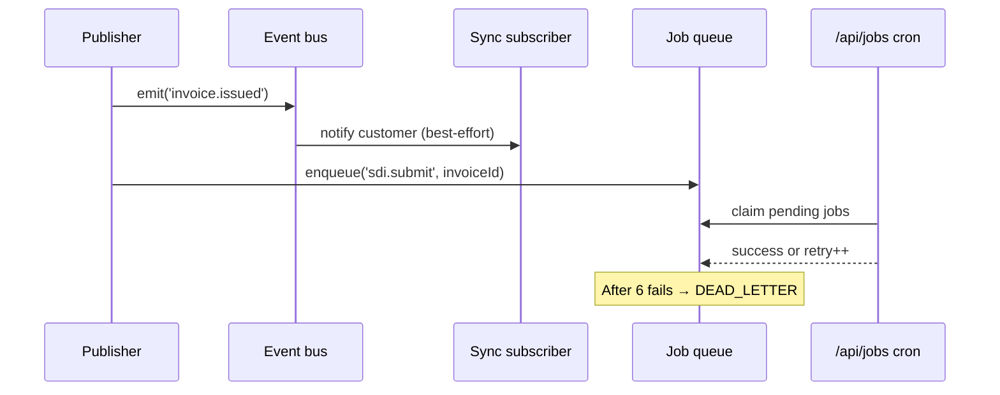

# Event bus

Almost every meaningful side effect in Bottega Digitale flows through `lib/event-bus.ts`. This is what makes the codebase feel modular even though it's a single Next.js process.

## The contract

```ts
import {emit, on} from '@/lib/event-bus';

// Publishers
await emit('booking.created', {bookingId, businessId, customerId});

// Subscribers (registered once at boot, in lib/event-router.ts)
on('booking.created', async (payload) => {
  await sendBookingConfirmation(payload);
});
```

- Events are **typed**. The event name and payload shape live in `lib/api-types.ts → EventMap`.
- Handlers are **async** but **non-blocking** for the publisher: they run on `queueMicrotask` so the HTTP response returns immediately.
- A failing subscriber **does not** abort the publisher. Errors are logged to `lib/observability.ts` and a `notification.failed` event is emitted.

## The full event catalog

| Event | Emitted by | Used by |
| --- | --- | --- |
| `booking.created` | `POST /api/booking-public`, dashboard | Notifications, CRM, loyalty, realtime, Google sync |
| `booking.cancelled` | Customer portal, dashboard | Notifications, loyalty rollback, realtime |
| `booking.completed` | Staff app | Loyalty award, review request, NPS survey |
| `order.placed` | Shop checkout | Notifications, inventory, invoice draft |
| `order.paid` | Stripe webhook | Notifications, loyalty, invoice issue |
| `invoice.issued` | `lib/e-invoice.ts` | SDI submission queue, accountant export |
| `loyalty.points.awarded` | `lib/customer-crm.ts` | Notifications, marketplace cross-promos |
| `whatsapp.message.received` | Meta webhook | AI router, automation rules |
| `customer.consent.changed` | GDPR portal | Audit log, CRM, marketing flags |
| `business.created` | Registration | Onboarding wizard, association portal |

The full list lives in `src/lib/api-types.ts` — search for `type EventMap`.

## Why an in-process bus and not a queue?

| Concern | In-process bus | External queue |
| --- | --- | --- |
| **Latency** | Microseconds | Milliseconds + network |
| **Ops cost** | Zero | Redis/RabbitMQ to operate |
| **Retries** | Manual via `job-scheduler` | Built-in |
| **Cross-instance** | No — but Next.js can scale a single instance to 5000 concurrent reqs | Yes |
| **Fits the customer** | An Italian micro-business in one region | Multi-region SaaS |

Bottega Digitale targets the first column. When you outgrow it, the swap is local: implement `emit()` to push to BullMQ or NATS and keep every subscriber unchanged.

## Durability: retries and dead letters

For side effects that **must** eventually succeed (e.g. SDI invoice submission), publishers also write a row to the `JobQueue` table via `lib/job-scheduler.ts`. The cron endpoint `/api/jobs` runs every 15 minutes (configured in `vercel.json`) and re-attempts pending jobs with exponential backoff up to 6 tries. After that, the job is marked `DEAD_LETTER` and surfaced in `/dashboard/notifications/failures`.



## Writing your own subscriber

Add a handler in `lib/event-router.ts`:

```ts
on('booking.completed', async ({bookingId, businessId}) => {
  const booking = await prisma.booking.findUnique({where: {id: bookingId}});
  if (!booking) return;
  await sendReviewRequest(booking);
});
```

For anything fallible, enqueue a job:

```ts
on('order.paid', async (payload) => {
  await enqueueJob('invoice.issue', payload, {attempts: 6});
});
```

## See also

- [Automation guide](../guides/whatsapp-automation) — wire user-defined rules onto the same bus
- [Webhook reference](../reference/webhooks) — turn internal events into outbound HTTP
