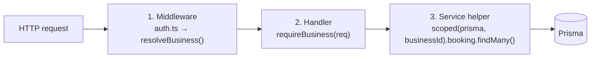

# Multi-tenancy

Bottega Digitale runs **many businesses** out of a single deployment and a single database. Each business is a **tenant**. This page explains the isolation model and how to add new features safely.

## The rule

> **Every row that isn't global must carry a `businessId` and every query must include it.**

There are two exceptions:

- **Platform tables** — `User`, `Session`, `ApiKey`, `Region`, `BusinessTemplate`. These either belong to platform-wide settings or are joined to a business via a relation.
- **Cross-business surfaces** — the marketplace and the public directory deliberately read across all tenants. They use dedicated, audited query helpers in `lib/marketplace.ts` and `lib/seo.ts`.

## How isolation is enforced

There are three layers of defence:



### 1. Middleware (`src/proxy.ts`)

The Next.js proxy/middleware resolves the active business from one of:

- the merchant's session cookie (dashboard routes),
- the URL slug (`/book/:slug`, `/shop/:slug`),
- an `X-Bottega-Business` header (API key requests).

It attaches `businessId` to the request context. Anything downstream can read it with `requireBusiness(req)`.

### 2. Handler

Every protected route handler starts with one of:

```ts
const business = await requireBusiness(req);   // throws 401 otherwise
const business = await requireRole(req, ['OWNER', 'STAFF']);
```

For public widgets, the slug is resolved server-side and the handler only ever queries within the resolved tenant.

### 3. Scoped Prisma helper

The `scoped()` helper in `lib/db.ts` wraps Prisma to inject `businessId` into every `where`, `data` and `update`:

```ts
import {scoped} from '@/lib/db';

const db = scoped(prisma, business.id);

// businessId is automatically merged
const bookings = await db.booking.findMany({
  where: {status: 'CONFIRMED'},
});

await db.customer.create({
  data: {name: 'Luca', phone: '+39...'},
});
```

If a developer forgets to use `scoped()`, the codebase's ESLint config (`eslint.config.mjs`) flags raw `prisma.X.findMany` calls in non-platform modules.

## Subdomains, slugs and custom domains

- **Default URL**: `bottegadigitale.it/s/<slug>` — short link.
- **Storefront**: `bottegadigitale.it/shop/<slug>` and `/book/<slug>`.
- **Custom domain**: each `Business` has an optional `customDomain`. The proxy resolves it to a `businessId` via the `Business.customDomain` index.

## Cross-tenant features

A handful of features are explicitly cross-tenant. They live in their own modules and never receive a scoped Prisma client:

| Feature | Module | Notes |
| --- | --- | --- |
| Public directory | `lib/seo.ts` | Read-only, only `published = true` rows |
| Marketplace | `lib/marketplace.ts` | Mediates partnerships across businesses |
| Trade association portal | `lib/association-portal.ts` | Aggregates over a `Business.associationId` set |
| Accountant portal | `lib/accountant-portal.ts` | Aggregates over a `Business.commercialistaId` set |
| Platform admin | `lib/platform-analytics.ts` | Super-admin only; full RBAC check |

## Adding a new feature safely

Checklist:

- [ ] New Prisma model has `businessId String` and `@@index([businessId, …])`.
- [ ] All queries go through `scoped()` or join via a relation that carries `businessId`.
- [ ] Route handler calls `requireBusiness` or `requireRole`.
- [ ] If the feature is public (no session), look up the business by slug **before** any other query.
- [ ] Add a test in `src/__tests__/multitenancy/` that proves Business A cannot read Business B.

## See also

- [Data model](./data-model) — the `businessId` foreign key pattern
- [Configuration](../reference/configuration) — custom domains and slugs
