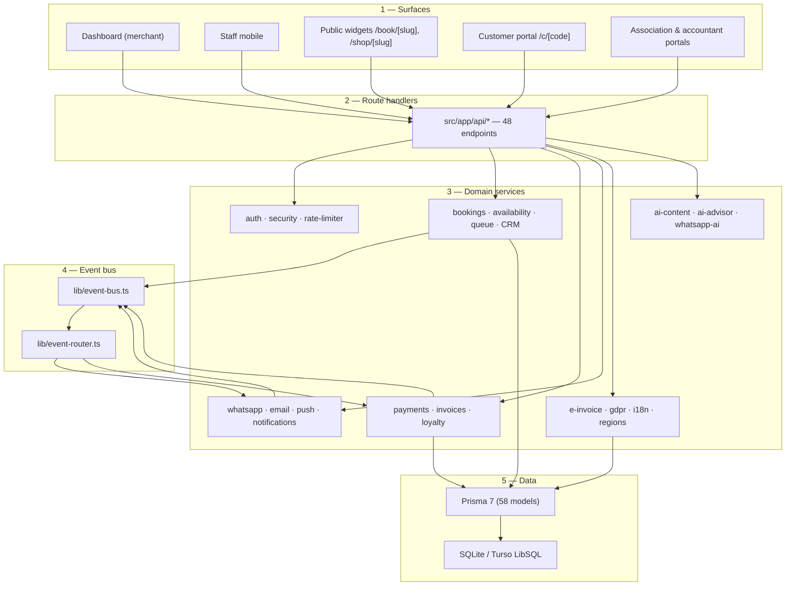

# Overview

Bottega Digitale is a **modular monolith**: every feature lives in the same Next.js app, communicates through a single event bus, and writes to a single Prisma schema. There are no microservices to operate, no queue infrastructure to configure, and no shared state outside Postgres-compatible storage.

## Five layers

### 1. Surfaces

Every UI is a route group under `src/app/`:

| Path | Audience |
| --- | --- |
| `/dashboard` | Business owners — the operations cockpit |
| `/staff` | Staff phones — checking in customers, marking jobs done |
| `/book/[slug]`, `/shop/[slug]`, `/s/[slug]` | Public widgets and storefronts |
| `/c/[code]` | Customer self-service (cancel/reschedule, OTP login) |
| `/association`, `/commercialista`, `/admin` | Multi-business portals |

### 2. Route handlers

48 endpoints under `src/app/api/`. They are **thin**: parse, authorise, call a domain service, return. No business logic lives here. See the [API reference](../reference/api).

### 3. Domain services

Everything substantive lives under `src/lib/`. Modules are organised by capability, not by entity — for example `lib/loyalty.ts` owns the points lifecycle, not the `LoyaltyCard` model.

### 4. Event bus

`lib/event-bus.ts` is an in-process pub/sub. Domain services emit events; subscribers in `lib/event-router.ts` route them to other domain services. This is how a booking confirmation triggers a WhatsApp message *and* a CRM update *and* a loyalty schedule, without any of those modules importing each other.

See [Event bus](./event-bus) for details.

### 5. Data

A single Prisma schema (`prisma/schema.prisma`, 58 models) backed by SQLite locally and Turso LibSQL in production. Every table has a `businessId` foreign key — see [Multi-tenancy](./multi-tenancy).

## Guiding principles

1. **One app, one database.** A solo founder must be able to operate this on a Hetzner VPS.
2. **Integrations degrade gracefully.** If WhatsApp keys are missing, messages log to stdout — the booking still succeeds.
3. **Italy first.** FatturaPA, IVA, codice fiscale, Italian locale, GDPR audit logs are not afterthoughts.
4. **WhatsApp before email.** The Italian SME's customer channel is WhatsApp. Email is the fallback.
5. **No drag-and-drop builders.** Templates, not blank canvases. Speed beats flexibility for non-tech users.

## Where to go next

- **Data model** → [Data model](./data-model)
- **Events & automation** → [Event bus](./event-bus)
- **Per-business isolation** → [Multi-tenancy](./multi-tenancy)
- **Pitch context** → [Why Bottega Digitale](./why)
