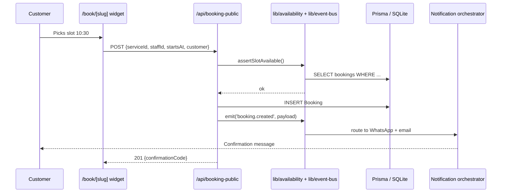

# Your first booking

Once the [quickstart](./quickstart) is running, this walkthrough takes a booking end-to-end so you can see how all the moving parts connect.

## The pieces involved



## 1. Open the public booking widget

Each seeded business has a public widget at `/book/<slug>`. Open:

```text
http://localhost:3000/book/barberia-da-marco
```

You will see Marco's services, available staff and a calendar.

## 2. Pick a slot

Choose **Taglio + Barba**, staff **Marco**, and the next free slot. The widget pulls availability from:

```http
GET /api/availability?businessSlug=barberia-da-marco&serviceId=svc_taglio_barba&staffId=staff_marco
```

The handler lives in `src/app/api/availability/route.ts` and delegates to `lib/availability.ts`, which combines staff working hours, existing bookings, queue items and blackout dates.

## 3. Submit the form

Fill in name and phone, accept the GDPR consent, and submit. The widget calls:

```bash
curl -X POST http://localhost:3000/api/booking-public \
  -H 'Content-Type: application/json' \
  -d '{
    "businessSlug": "barberia-da-marco",
    "serviceId": "svc_taglio_barba",
    "staffId": "staff_marco",
    "startsAt": "2026-04-12T10:30:00+02:00",
    "customer": {
      "name": "Luca Bianchi",
      "phone": "+39 333 1234567",
      "locale": "it",
      "gdprConsent": true
    }
  }'
```

The response includes a short confirmation code:

```json
{
  "id": "bkg_01J...",
  "confirmationCode": "BD-7H42",
  "status": "confirmed",
  "startsAt": "2026-04-12T10:30:00+02:00"
}
```

## 4. Inspect what happened

Behind the scenes, the API handler emitted a `booking.created` event on the in-process event bus (`lib/event-bus.ts`). Subscribers fired in this order:

| Subscriber | Effect (with keys configured) | Effect (no keys) |
| --- | --- | --- |
| `notification-orchestrator` | WhatsApp + email confirmation to the customer | Logged to stdout |
| `crm` | Upserts the customer, increments visit counter | Same |
| `loyalty` | Schedules points after the appointment completes | Same |
| `realtime` | Pushes an SSE event to the merchant dashboard | Same |

Refresh the dashboard at [http://localhost:3000/dashboard](http://localhost:3000/dashboard) — the booking appears in **today's agenda** in real time.

## 5. Cancel or reschedule

The customer receives a self-service link (`/c/<code>`) that lets them cancel or move the appointment without logging in. Internally that hits `/api/booking-public/[code]` and emits `booking.cancelled`, which propagates to the same subscribers.

## You did it

You now understand the whole flow: **widget → API → service module → event bus → side effects**. Every other feature in Bottega Digitale follows the exact same shape — see [Core concepts](../concepts/overview) for the mental model.
