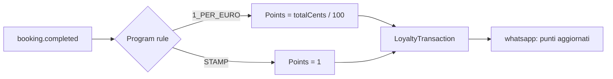

# Loyalty programs

The digital evolution of the paper fidelity card every Italian shop hands out. Bottega Digitale's loyalty engine is built around three primitives: **programs**, **cards**, and **transactions**.

## Concepts

- A **LoyaltyProgram** is the merchant's ruleset: how points are earned, what they're worth, and what rewards exist.
- A **LoyaltyCard** is one customer's enrollment in a program. A customer has one card per merchant.
- A **LoyaltyTransaction** is an immutable ledger entry — either an earn or a redeem.

Programs are scoped per merchant; cards and transactions inherit the merchant via the card.

## 1. Create a program

```bash
curl -X POST http://localhost:3000/api/loyalty/programs \
  -H 'Content-Type: application/json' \
  -d '{
    "name": "Marco Club",
    "earnRule": "1_PER_EURO",
    "rewardTiers": [
      {"points": 100, "reward": "Taglio gratis", "skuId": "svc_taglio"},
      {"points": 250, "reward": "Trattamento barba premium"}
    ],
    "expiryMonths": 12
  }'
```

`earnRule` is one of:

| Rule | Effect |
| --- | --- |
| `1_PER_EURO` | 1 point per €1 spent (rounded down) |
| `STAMP` | 1 point per visit, regardless of spend |
| `TIER` | Custom thresholds — see `lib/customer-crm.ts` |

## 2. Award points automatically

Points are awarded by an event subscriber, not by explicit calls:



A merchant can disable auto-award per service (e.g. for promotional discounts) by setting `Service.awardsLoyalty = false`.

## 3. Redeem a reward

From the dashboard or staff app:

```bash
curl -X POST http://localhost:3000/api/loyalty/redeem \
  -d '{"cardId": "lc_...", "tierIndex": 0}'
```

This:

1. Inserts a `LoyaltyTransaction` of `type: 'REDEEM'` with negative points.
2. Issues a one-shot discount voucher attached to the customer.
3. Fires `loyalty.redeemed` on the event bus.

Idempotency: redeem calls require an `Idempotency-Key` header in production.

## 4. Show the card to the customer

Customers see their points and rewards at `/c/<code>/loyalty`. They get a fresh OTP via WhatsApp the first time they open the link. The page is mobile-first and works as a PWA — they can add it to their home screen as a "digital card".

## 5. Promote inactivity recovery

Lapsed customers (no visit in 60 days) automatically receive a re-engagement message if `automation.lapsed_customer` is enabled:

```json
{
  "trigger": "customer.lapsed.60d",
  "actions": [{
    "type": "whatsapp.template",
    "template": "bd_winback_it",
    "variables": ["{{customer.name}}", "{{loyalty.points}}"]
  }]
}
```

Lapsed-customer detection runs in the `/api/jobs` cron daily.

## Reporting

The dashboard surfaces:

- **Active cards** — cards with at least one transaction in the last 90 days
- **Average points per visit** — across active cards
- **Reward burn rate** — points redeemed / points awarded (target ~30%)
- **Top redeemed reward** — informs reward design

## Expiry

If `expiryMonths` is set, the daily cron emits `loyalty.points.expired` on any transaction older than the window. Expired points produce a negative ledger entry so the balance equation always holds: `balance = SUM(transactions)`.

## See also

- [Online booking](./online-booking) — what triggers earning
- [WhatsApp automation](./whatsapp-automation) — winback and rewards messaging
