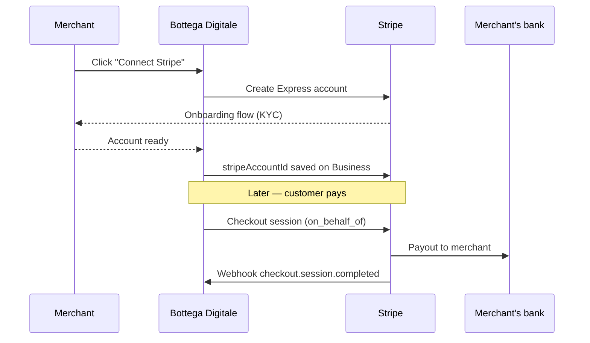

# Payments with Stripe Connect

Bottega Digitale uses **Stripe Connect (Express)** so that each merchant has their own Stripe account — money lands directly in the bottega's bank, not in a platform wallet. Bottega Digitale only collects optional application fees.

## How it works



## 1. Configure Stripe keys

```bash
STRIPE_SECRET_KEY="sk_test_..."
STRIPE_WEBHOOK_SECRET="whsec_..."
STRIPE_PLATFORM_FEE_BPS="0"       # 0 = no platform fee; 100 = 1%
NEXT_PUBLIC_STRIPE_PUBLISHABLE_KEY="pk_test_..."
```

The webhook secret is for the **platform** account, not the connected accounts. Stripe automatically forwards events from connected accounts to the same endpoint with `account` in the payload.

## 2. Point Stripe webhooks at your app

```text
POST https://<your-domain>/api/stripe/webhook
```

Events handled:

| Event | Effect in Bottega Digitale |
| --- | --- |
| `checkout.session.completed` | Mark `Payment` as paid, fire `order.paid` |
| `payment_intent.succeeded` | Same, when not via Checkout |
| `payment_intent.payment_failed` | Notify merchant, retry once |
| `charge.refunded` | Reverse loyalty points, fire `order.refunded` |
| `account.updated` | Mark merchant's onboarding state |

The handler verifies signatures via `stripe.webhooks.constructEvent`.

## 3. Onboard a merchant

From the dashboard the merchant clicks **Settings → Payments → Connect Stripe**, which calls:

```bash
POST /api/stripe/connect/onboard
```

The handler creates an Express account, generates an onboarding link, and redirects the merchant to Stripe. When they return, `account.updated` fires and Bottega Digitale stores `Business.stripeAccountId`.

## 4. Take a payment

The simplest path is **Stripe Checkout** for deposits and orders:

```ts
import {createCheckoutSession} from '@/lib/payments';

const session = await createCheckoutSession({
  businessId,
  items: [{name: 'Taglio + Barba', amountCents: 2500, quantity: 1}],
  successUrl: `${env.NEXT_PUBLIC_URL}/c/${booking.confirmationCode}`,
  cancelUrl: `${env.NEXT_PUBLIC_URL}/book/${business.slug}`,
  metadata: {bookingId: booking.id},
});

return Response.redirect(session.url);
```

For in-page payments (e.g. saved cards in the dashboard) use `PaymentIntent`:

```ts
const intent = await createPaymentIntent({
  businessId,
  amountCents: 5000,
  customerStripeId: customer.stripeCustomerId,
  description: `Order ${order.id}`,
});
```

Both helpers automatically set `on_behalf_of` and `transfer_data.destination` to the merchant's connected account.

## 5. Reconcile in the dashboard

The dashboard's **Payments** tab pulls from the `Payment` table — every Stripe object has a one-to-one mirror in your database with `status` updated by the webhook. This means you can show payment status even when Stripe is unreachable.

## Refunds

From the dashboard, a refund triggers:

```ts
await stripe.refunds.create(
  {payment_intent: payment.stripePaymentIntentId},
  {stripeAccount: business.stripeAccountId}
);
```

The `charge.refunded` event then reverses loyalty points and emits `order.refunded`.

## Application fees (optional)

Set `STRIPE_PLATFORM_FEE_BPS` to take a basis-point fee on each transaction. For example, `100` = 1% — applied via `application_fee_amount` on the Checkout session. Fees land on the platform account; payouts to the platform happen on the platform's normal Stripe schedule.

## Without Stripe keys: dev mode

Without `STRIPE_SECRET_KEY` configured, `lib/payments.ts` returns a fake session whose `url` is a local success page. The booking flow still works; payments are marked `Payment.mode = 'DEV'`. This is useful for end-to-end tests.

## See also

- [FatturaPA invoicing](./fattura-pa) — issue a fiscal invoice for the paid order
- [API reference — payments](../reference/api#payments--billing)
