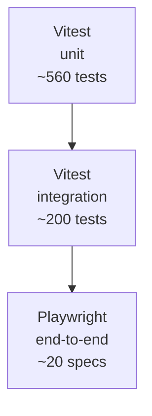

# Testing

Bottega Digitale ships with **~780 tests** running on Vitest and Playwright. The suite runs in well under a minute and is part of every PR check.

## The pyramid



| Layer | Tool | Lives in | Runs in |
| --- | --- | --- | --- |
| Unit | Vitest | `src/__tests__/unit/` | < 10s |
| Integration | Vitest + Prisma | `src/__tests__/integration/` | < 30s |
| End-to-end | Playwright | `e2e/` | < 60s |

## Run them

```bash
npm test               # all Vitest (unit + integration)
npm run test:watch     # watch mode
npm run test:coverage  # coverage with 60% threshold on src/lib
npm run test:e2e       # Playwright
npm run test:e2e:ui    # Playwright with UI
```

## Conventions

### File naming

```
src/lib/availability.ts
src/__tests__/unit/availability.test.ts
src/__tests__/integration/booking-flow.test.ts
e2e/booking-public.spec.ts
```

### Integration tests use a real database

Integration tests spin up an isolated SQLite file per worker:

```ts
import {testDb} from '@/__tests__/helpers/db';

const {prisma, seed} = await testDb();
```

`testDb()` runs `prisma db push` against an in-memory or temp-file database and seeds whichever fixtures the test requests. There is no HTTP mocking; tests call domain services directly.

### Time freezing

Use `vi.useFakeTimers()` and the `setNow()` helper from `__tests__/helpers/time.ts`:

```ts
import {setNow} from '@/__tests__/helpers/time';

setNow('2026-04-12T09:00:00Z');
const slots = await getSlots({...});
```

### Multi-tenancy regression tests

`src/__tests__/multitenancy/` has a small but important set of tests that prove **no service** leaks data across `businessId`. New domain services should add at least one such test.

## Coverage targets

| Path | Target |
| --- | --- |
| `src/lib/**` | 60% (enforced) |
| `src/app/api/**` | 50% |
| Overall | not enforced |

Domain logic is heavily tested; route handlers are thin enough that integration tests cover them implicitly.

## Adding a test

1. Place it in the matching `__tests__/` folder.
2. Use the helpers in `__tests__/helpers/`.
3. Don't mock Prisma — use a real test database.
4. For external services (Stripe, WhatsApp, OpenAI), use the **fake implementations** wired up when env vars are empty.

## CI

GitHub Actions runs:

1. `npm run lint`
2. `npm test`
3. `npm run test:e2e` (against a built dev server)

The full check completes in ~3 minutes.

## Flakiness policy

If you introduce a flaky test, you own fixing it. We do not retry on CI — a retry quietly masks bugs. Mark genuinely time-dependent tests with `test.concurrent` only when they have no shared state.
